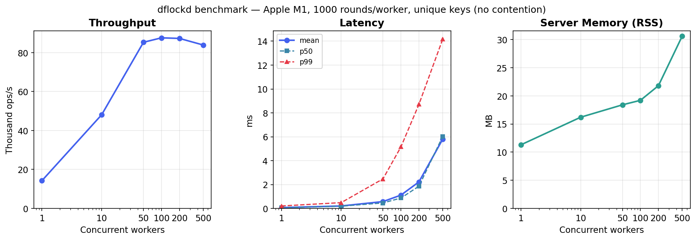

# dflockd

A lightweight distributed lock server using a simple line-based TCP protocol with FIFO ordering, automatic lease expiry, and background renewal.

## Features

- **Strict FIFO ordering** — waiters are granted locks in the order they enqueue, per key
- **Two-phase lock acquisition** — split enqueue and wait to notify external systems between joining the queue and blocking
- **Automatic lease expiry** — held locks expire if not renewed, preventing deadlocks
- **Disconnect cleanup** — locks are released automatically when a client disconnects
- **Pub/sub signals** — publish messages to channels with wildcard pattern matching (`*`, `>`) and optional queue groups for load-balanced delivery
- **Zero dependencies** — single Go binary
- **Go client library** — high-level `Lock` type with automatic renewal and sharding, plus low-level protocol API
- **Runtime stats** — query active connections, held locks, semaphores, signal channels, and idle entries via the `stats` command
- **Built-in benchmarking** — `cmd/bench` measures lock throughput and latency under concurrent load
- **Simple wire protocol** — line-based UTF-8 over TCP, easy to integrate from any language

## Quick example

```bash
$ nc localhost 6388
l
my-key
10
ok abc123... 33
r
my-key
abc123...
ok
```

Locks are auto-released on disconnect, so the connection must stay open.

## Performance

Each operation is one lock acquire + release over a persistent TCP connection. Measured on an Apple M1 (MacBook Air, 8 GB RAM) with server and clients on localhost.



| Workers | Rounds | Ops | Throughput | Mean | p50 | p99 | Server RSS |
|---|---|---|---|---|---|---|---|
| 1 | 1,000 | 1,000 | 14,258 ops/s | 0.069 ms | 0.054 ms | 0.207 ms | 11.3 MB |
| 10 | 1,000 | 10,000 | 48,104 ops/s | 0.205 ms | 0.187 ms | 0.486 ms | 16.2 MB |
| 50 | 1,000 | 50,000 | 85,266 ops/s | 0.572 ms | 0.459 ms | 2.473 ms | 18.4 MB |
| 100 | 1,000 | 100,000 | 87,543 ops/s | 1.115 ms | 0.871 ms | 5.154 ms | 19.2 MB |
| 200 | 1,000 | 200,000 | 87,243 ops/s | 2.222 ms | 1.859 ms | 8.715 ms | 21.8 MB |
| 500 | 1,000 | 500,000 | 83,856 ops/s | 5.802 ms | 6.032 ms | 14.173 ms | 30.6 MB |

All workers use unique keys (no contention). Run your own: `go run ./cmd/bench --help`

## Getting started

- [Installation](getting-started/installation.md) — build from source or `go install`
- [Quick Start](getting-started/quickstart.md) — run the server and acquire your first lock
- [Examples](getting-started/examples.md) — TCP protocol examples and Go client usage

## Client libraries

- [Go](client.md) — in-repo `client` package with automatic renewal, sharding, two-phase locking, and signals ([docs](client.md))
- [Python](https://github.com/mtingers/dflockd-client-py) — async/sync client with `DistributedLock` context manager ([docs](https://mtingers.github.io/dflockd-client-py/))
- [TypeScript](https://github.com/mtingers/dflockd-client-ts) — TypeScript/JavaScript client ([docs](https://mtingers.github.io/dflockd-client-ts/))

## Reference

- [Server Configuration](server.md) — CLI flags, environment variables, TLS, authentication, and tuning
- [Wire Protocol](architecture/protocol.md) — line-based TCP protocol specification, commands, and error codes
- [Architecture](architecture/overview.md) — server internals, lock state, concurrency model, and signal delivery
- [Changelog](changelog.md) — release history
